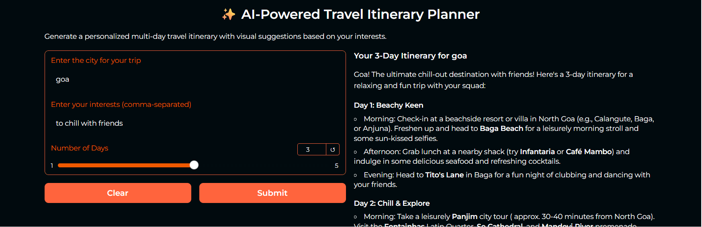
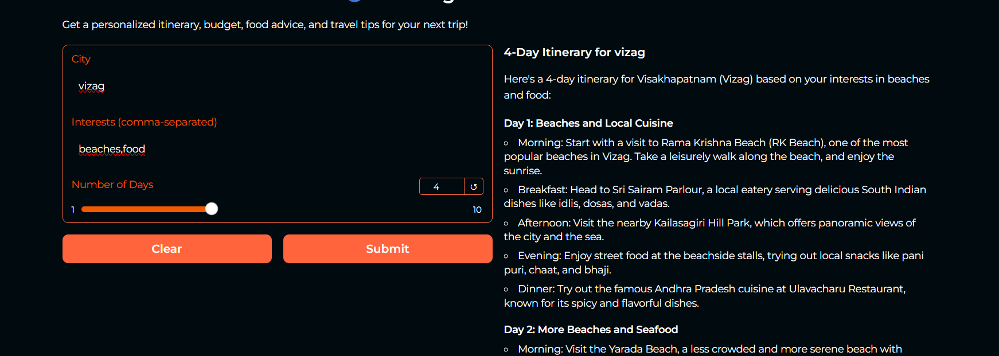

# Travel-Planner-with-Multi-AI-Agents-and-LangGraph
# 🧳 Travel Itinerary Planner (AI-powered with Gradio + Groq)

This is a web app that generates personalized travel itineraries using AI (Llama 3 via Groq API), based on your selected city and interests.

## 🚀 Features
- Multi-day itinerary generation
- Visual suggestions via images
- Sleek dark theme

## 🔧 How to Run
1. Clone this repo
2. Install dependencies:
   #### pip install -r requirements.txt
3. Run the app:
    #### python travel_planner_ai_agent.py

